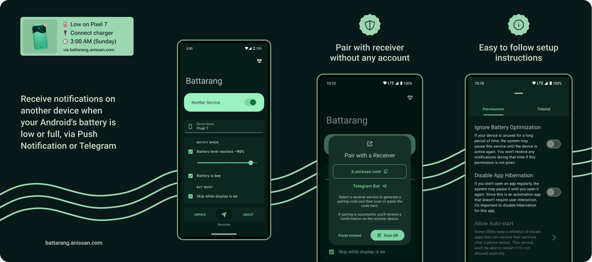

# Battarang Notifier for Android

Battarang sends notifications to another device via Browser Push Notification or Telegram Bot when
your Android's battery is low or full.
Visit [battarang.anissan.com](https://battarang.anissan.com) for more info.

## Architecture

The architecture of this project may seem unfamiliar to a seasoned Android developer
because I came up with an architecture that is tailored to the features of this project.
I took a web dev approach rather than over-engineering a Google scale solution where it feels
counter-productive.

Essentially the source of truth is SharedPref KV storage and, the Views get updated by observing the
changes.
It's kind of like a poor man's reactive system.

I've also heavily used Kotlin Extension Functions rather than Classes to help with the composition
to minimize the changes to a few places as possible.

## Build

1. Copy the properties from [local.example.properties](local.example.properties)
   to `local.properties` and provide the values
2. `🔨 Make Project` or `▶️ Run` the app

## Information

**Author:** [Nissan Ahmed](https://anissan.com) ([@ni554n](https://twitter.com/ni554n))

**Donate:** [PayPal](https://paypal.me/ni554n)

## License

This project intentionally
has [no license](https://docs.github.com/en/repositories/managing-your-repositorys-settings-and-features/customizing-your-repository/licensing-a-repository#choosing-the-right-license)
so the default copyright laws apply,
which means I retain all rights to the source code and the graphical assets.
No one may reproduce, distribute, or create derivative works from this work without my permission.

However you are free to view, contribute, and copy parts of the code into your own project without
attribution.
You are just not allowed to repackage and redistribute the entire app.
